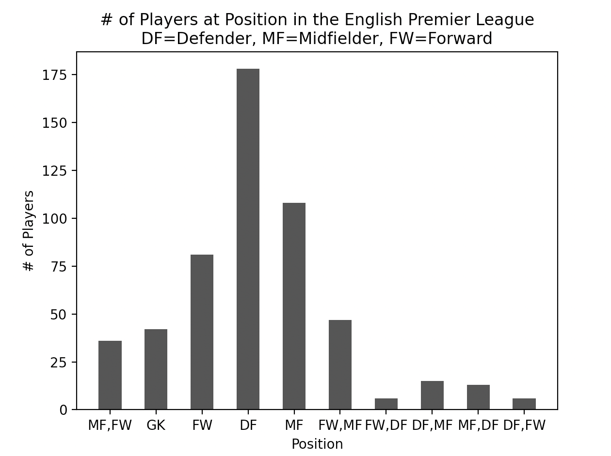
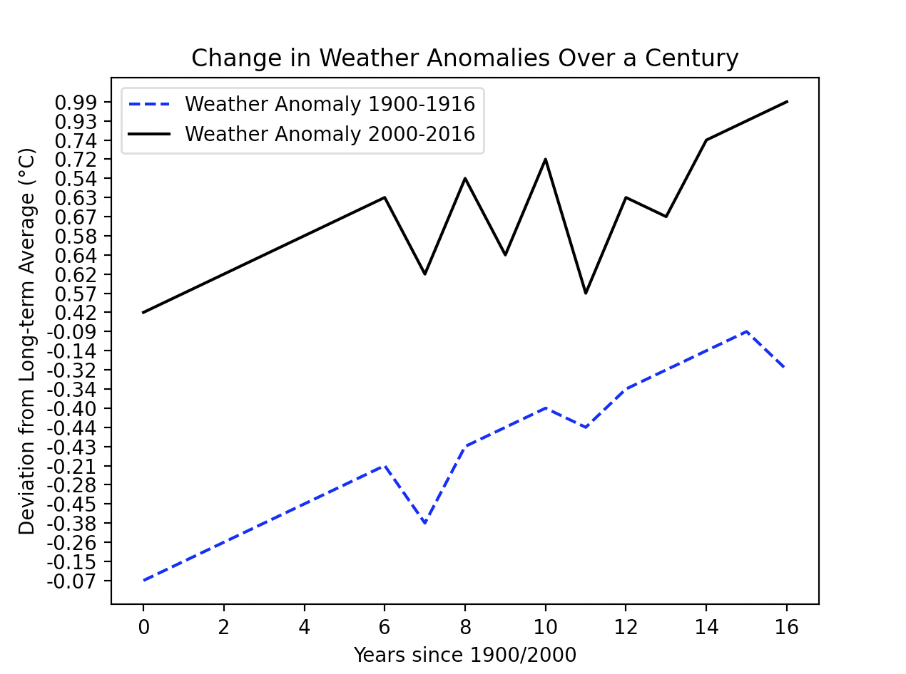

# Project 2: Data Visualization [(Github Link)](https://github.com/mikeizbicki/cmc-csci040/tree/2022fall/project_02)
## Graph 1: Number of Players in Each Position (English Premier League)

This graph depicts the number of players in [each position in the English Premier League](https://www.kaggle.com/datasets/rajatrc1705/english-premier-league202021). Some players play a main position and other sub positions, which result in positions like FW/MF and MF/FW. As the graph clearly shows, the league leans heavily towards defenders.

## Graph 2: Weather Anomaly Comparison Between 1900-1916 and 2000-2016

This graph compares the [weather anomaly detected between 1900-1916 and 2000-2016](https://www.ncei.noaa.gov/access/monitoring/climate-at-a-glance/global/time-series/globe/land_ocean/ytd/12/1880-2016.json). Weather anomalies are the deviation from the expected temperature. As clearly shown in the graph, the average anomaly is much greater in the 21st century, meaning that global warming can be seen within this graph.